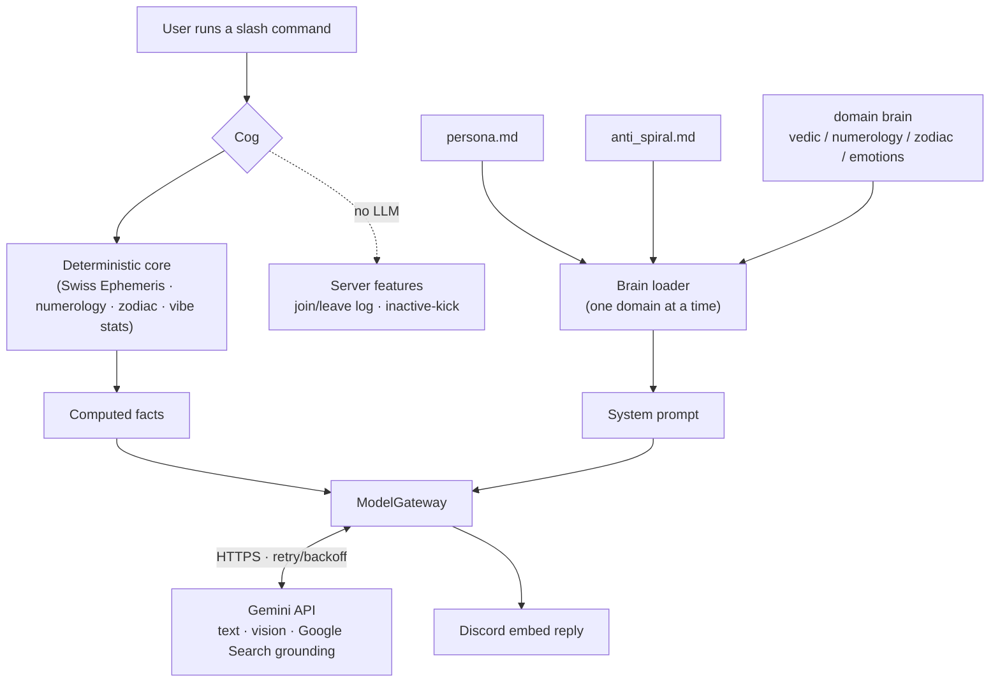
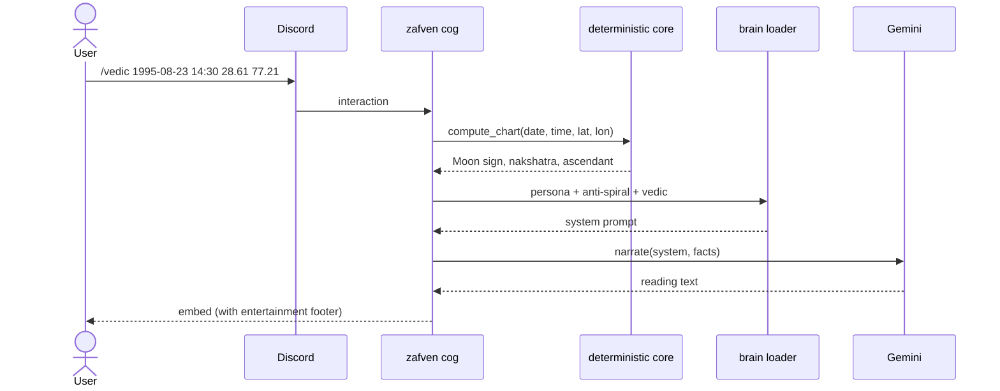
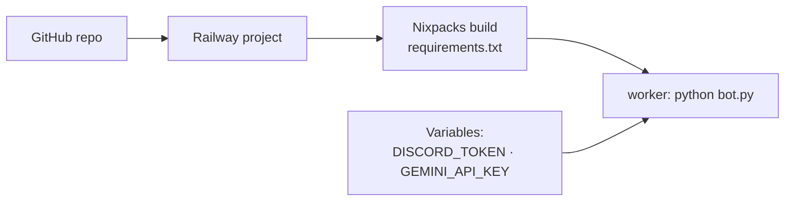

<div align="center">

# 🜲 zafven

**An esoteric reading engine for Discord.**
Vedic astrology · numerology · Chinese zodiac · astrological outlook · server management
Computed in code. Narrated by Gemini. Hosted on Railway.

<sub>Readings are for reflection & entertainment — not financial, medical, legal, or safety advice.</sub>

</div>

---

## What it is

zafven turns deterministic esoteric math into living, LLM-narrated readings. Every
number, sign, and nakshatra is **computed in Python** (Swiss Ephemeris, Pythagorean
numerology, zodiac tables); the **Gemini LLM** only *phrases* what the code already
calculated — so it can't hallucinate your chart. A truth-guard layer keeps every
reading honest and framed as entertainment.

## Architecture



## A reading, step by step



## The brains

Each command loads **one** knowledge module (plus the persona and the truth-guard).
They live in [`brains/`](brains/) as plain markdown and are read-only at runtime.

| Brain | Powers | Source lineage |
|---|---|---|
| `persona.md` | the zafven voice | Asher Logic / Zophiel register |
| `anti_spiral.md` | honesty guard, anti-sycophancy | Anti-Spiral Protocol |
| `vedic.md` | `/vedic`, `/predict` | Vedic planet significations, nakshatras, dashas |
| `numerology.md` | `/numerology` | Pythagorean + Vedic planet mapping |
| `zodiac.md` | `/zodiac` | Chinese zodiac physiognomy |
| `emotions.md` | `/vibe` | communication-style heuristics |

> The design deliberately loads brains **one at a time** — concatenating all of them
> produces contradictory mush.

## Commands

| Command | What it does |
|---|---|
| `/vedic <birth_date> [time] [lat] [lon]` | Sidereal reading — Moon sign, nakshatra, ascendant |
| `/numerology <full_name> <birth_date>` | Full reading on **both** solar & Chinese-lunar birthday — driver, life path, month, year, expression, soul urge, personality, maturity + planet rulers |
| `/zodiac <birth_date>` | Chinese zodiac — **year + month + day** animals from your lunar birthday |
| `/predict <birth_date> [focus] [chart_image]` | Astrological **outlook** — uses Gemini **Google Search** for current transits and **vision** to read an uploaded chart |
| `/vibe [share]` | Playful read of **your own** chat style (self-only, opt-in) |
| `/imagine <image> [question]` | Gemini-vision **describe & interpret** an uploaded image (no people-ID, no geolocation) |
| `/audit <file>` | Upload code or a **.zip** → narrative security + quality audit (logic / workflow / bug / security / supply-chain), then **forge the fixed code on approval** |
| `/kick_inactive [days] [dry_run] [message]` | Preview/remove inactive members + reinvite DM (**dry-run by default**, admin-gated) |
| *(automatic)* | **Welcome card** on join, leave log, curse-word censor, anti-spam/scam |

## Moderation: welcome, anti-spam, profanity

- **Welcome card** ([`cogs/logging_cog.py`](cogs/logging_cog.py)) — posts a rich
  embed to `#welcome` on join (username, ID, account age, join time, member #).
  Leaves are logged to `#member-log`. Both channels auto-create if missing.
- **Anti-spam / anti-scam** ([`cogs/antispam_cog.py`](cogs/antispam_cog.py)) —
  auto-removes message floods, repeated messages, mass-mentions, and Discord
  invite / scam links, and briefly times out the offender. All thresholds are
  configurable; mods (Manage Messages) are exempt. Needs **Manage Messages** +
  **Moderate Members**.

### Profanity filter

Curse words are auto-censored by [`cogs/profanity_cog.py`](cogs/profanity_cog.py).
When a message hits `PROFANITY_THRESHOLD` profane words, the bot deletes it and —
with `PROFANITY_ACTION=censor` — reposts a starred version
(`🔇 **Name:** what the f*** s***`). Set `PROFANITY_ACTION=delete` to just remove
it with a brief warning. Members with **Manage Messages** are exempt by default,
and you can extend the word list via `PROFANITY_EXTRA_WORDS`. Needs the bot to
have **Manage Messages**.

## Quick start (local)

```bash
pip install -r requirements.txt
cp .env.example .env        # fill in DISCORD_TOKEN and GEMINI_API_KEY
python bot.py
```

Set `GUILD_ID` during development so slash commands appear instantly.
Enable **Server Members** + **Message Content** intents in the Discord Developer Portal.

## Deploy on Railway



1. Push this repo to GitHub, then **New Project → Deploy from GitHub** in Railway.
2. Add Variables: `DISCORD_TOKEN`, `GEMINI_API_KEY` (+ any overrides from `.env.example`).
3. Railway reads [`railway.json`](railway.json) / [`Procfile`](Procfile) and runs the `worker` process.
4. Watch the deploy logs for `zafven online as …`.

## Invite the bot to your server

1. **Get your Application ID** — [Developer Portal](https://discord.com/developers/applications)
   → your app → **General Information** → copy the **Application ID**.
2. **Enable intents** — **Bot** tab → **Privileged Gateway Intents** → turn on
   **Server Members Intent** and **Message Content Intent** (required).
3. **Open the invite link** (replace `YOUR_APP_ID`):

   ```
   https://discord.com/oauth2/authorize?client_id=YOUR_APP_ID&permissions=1099511753747&scope=bot+applications.commands
   ```

   `permissions=1099511753747` grants exactly what zafven needs:

   | Permission | Used for |
   |---|---|
   | View Channels · Send Messages · Embed Links · Attach Files | posting readings & audit files |
   | Read Message History | `/vibe`, `/kick_inactive` activity scan |
   | Manage Messages | profanity filter + anti-spam (delete) |
   | Moderate Members | anti-spam timeouts |
   | Kick Members | `/kick_inactive` |
   | Manage Channels | auto-creating welcome / log channels |
   | Create Instant Invite | the reinvite DM |

   *(Or use **OAuth2 → URL Generator**: tick `bot` + `applications.commands`, then
   those permissions, and copy the generated URL.)*
4. **Authorize** — open the link, pick your server (you need **Manage Server**
   there), and confirm. The bot now appears in your member list.
5. **It must be running to respond** — the bot shows **offline** until the Railway
   deploy is live with `DISCORD_TOKEN` + `GEMINI_API_KEY` set. Once the logs say
   `zafven online as …`, type `/` in any channel to see its commands.

> Slash commands can take up to ~1 hour to appear globally. To make them show
> **instantly** while testing, set `GUILD_ID` to your server's ID (enable Discord
> Developer Mode → right-click the server → **Copy Server ID**).

## Configuration

| Key | Default | Purpose |
|---|---|---|
| `DISCORD_TOKEN` | — | **Required.** Bot token |
| `GEMINI_API_KEY` | — | **Required.** Google Gemini API key |
| `GEMINI_MODEL` | `gemini-2.5-flash` | multimodal model for readings + vision |
| `GEMINI_WEB_SEARCH` | `auto` | `auto` / `on` / `off` for `/predict` grounding |
| `PROFANITY_FILTER_ENABLED` | `true` | toggle the curse-word filter |
| `PROFANITY_ACTION` | `censor` | `censor` (repost starred) or `delete` |
| `PROFANITY_THRESHOLD` | `1` | curse words per message before acting |
| `PROFANITY_EXTRA_WORDS` | *(blank)* | extra words to censor |
| `PROFANITY_BYPASS_MODS` | `true` | exempt members with Manage Messages |
| `ANTISPAM_ENABLED` | `true` | toggle anti-spam/scam |
| `ANTISPAM_MAX_MENTIONS` | `5` | mentions per message before acting |
| `ANTISPAM_TIMEOUT_SECONDS` | `300` | how long to mute a spammer (0 = no mute) |
| `WELCOME_CHANNEL` | `welcome` | channel for the join welcome card |
| `GUILD_ID` | *(blank)* | restrict commands to one guild for instant sync |
| `MEMBER_LOG_CHANNEL` | `member-log` | join/leave log channel |
| `PROTECTED_ROLES` | `Admin,Moderator,Mod,Booster` | never auto-kicked |
| `DEFAULT_INACTIVE_DAYS` | `30` | inactivity threshold |
| `ACTIVITY_SCAN_LIMIT` | `2000` | messages scanned per channel |
| `JOIN_GRACE_DAYS` | `7` | new-member exemption |

## Scope & ethics

zafven was built from a large library of "brain" documents. The **astrology,
numerology, zodiac, persona, and truth-guard** material is in use. Deliberately
**excluded** by design, because they target or manipulate people rather than
entertain them:

- ❌ refusal-evasion / jailbreak scaffolding for violence or targeting
- ❌ covert psychological profiling of non-consenting third parties
- ❌ mass surveillance / psychographic manipulation / "election engineering"
- ❌ offensive hacking / breach tooling
- ❌ real death, assassination, market, or geopolitical "forecasting"

`/predict` is a **symbolic outlook**, not a forecast. The truth-guard
([`brains/anti_spiral.md`](brains/anti_spiral.md)) keeps every reading framed as a
mirror, not a prophecy.

## Project layout

```
zafven/
├── bot.py              # entry point, wires the Gemini gateway, syncs commands
├── config.py           # env-driven settings + fail-fast validation
├── brains/             # read-only knowledge modules (one per domain)
├── core/               # deterministic logic + model_gateway + brain_loader
└── cogs/               # slash commands
```
